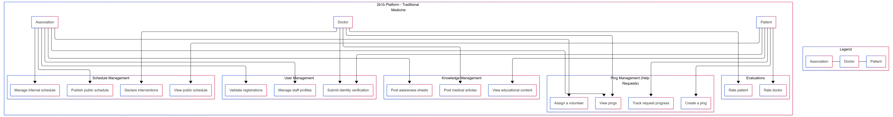
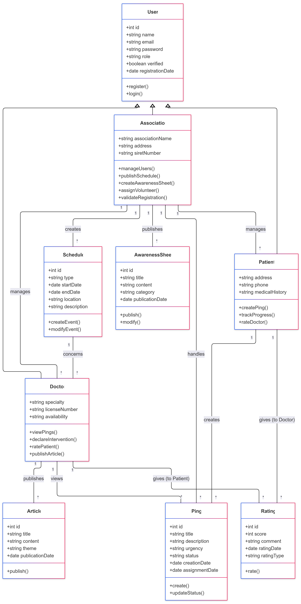
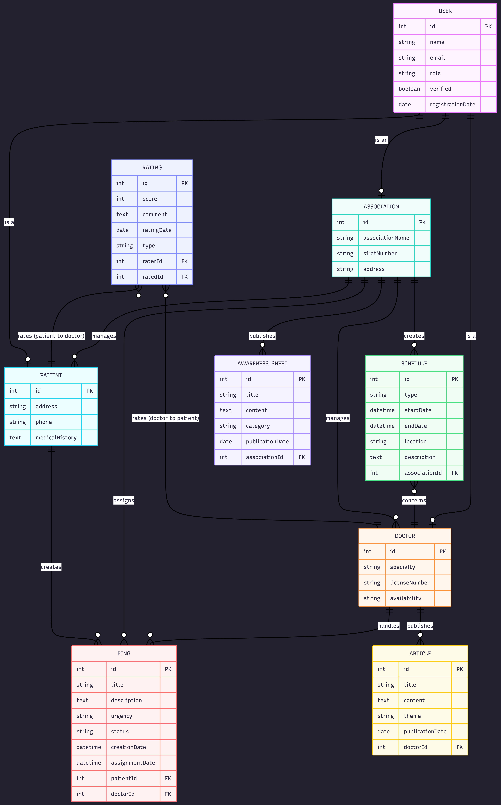
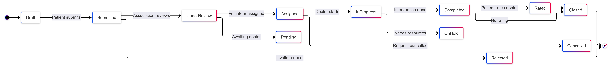

# Application Architecture

Here are the main components of the 2b1b application architecture:

## Use Cases

  

## Class Diagram

  

## Sequence Diagram

  

## Entity Relationship Diagram

  

## User Flow Diagram

  

## State Diagram

  

